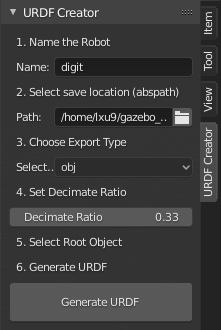

# Blender URDF Exporter

## Example

```
<?xml version="1.0" encoding="utf-8"?>
<robot name="my_robot">

 <!-- Links --> 

  <link name="Caster Rl Link">
                        <inertial>
                          <origin xyz="0 0 0" rpy="0 0 0" />
                          <mass value="10" />
                          <inertia  ixx="0" ixy="0" ixz="0" iyy="0" iyz="0" izz="0" />
                        </inertial>
                        <visual>
                          <origin xyz="0 0 0" rpy="0 0 0" />
                          <geometry>
                            <mesh filename="Caster Rl Link.dae" />
                          </geometry>
                        </visual>
                        <collision>
                          <origin xyz="0 0 0" rpy="0 0 0" />
                          <geometry>
                            <mesh filename="Caster Rl Link.dae" />
                          </geometry>
                        </collision>
                      </link>

...

<joint name="Appdeck Standard Link_Wheel Fr Link_joint" type="continuous">  
                        <origin xyz="-0.20082171261310577 -0.017650939524173737 0.794082522392273" 
                                rpy="-3.1416990756988525 0.0 0.0" />  
                        <parent link="Appdeck Standard Link" />  
                        <child link="Wheel Fr Link" />  
                        <axis xyz="1 0 0" />   
                    </joint>
</robot>
```


